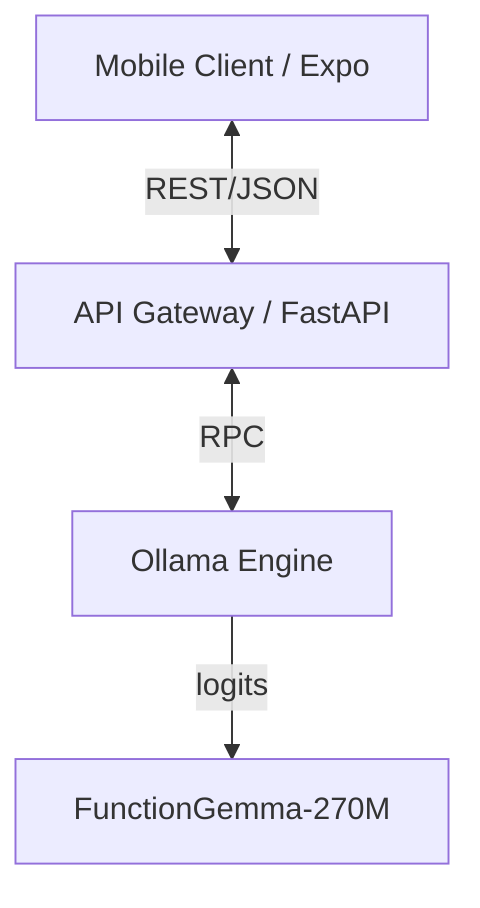

# Nova: Edge-Native AI Orchestration Architecture

This repository contains the reference implementation for **Nova**, a distributed mobile AI architecture designed for low-latency, privacy-preserving inference. It leverages a split-compute model where **Expo (React Native)** serves as the client presentation layer, communicating with a local inference node powered by **FunctionGemma-270M-IT** via **Ollama**.

## System Architecture

The system implements a client-server topology designed for edge deployment:

*   **Client Layer**: React Native application utilizing asynchronous I/O for non-blocking UI rendering.
*   **Orchestration Layer**: FastAPI microservice serving as an API Gateway. It handles request normalization, prompt injection, and response schema enforcement.
*   **Inference Engine**: Ollama instance hosting Quantized GGUF models (FunctionGemma-270M), optimized for CPU-based inference on commodity hardware.



## Technical Specifications

### Inference Node (Backend)
The backend service functions as a middleware layer responsible for **Structured Output Enforcement**. It utilizes **Pydantic** models to validate stochastic LLM outputs against strict JSON schemas, ensuring type safety for the client application.

#### Prerequisites
*   **Runtime**: Python 3.10+
*   **Inference Server**: Ollama (v0.1.0 or higher)
*   **Model Registry**: `functiongemma:latest` or `functiongemma:270m`

#### deployment Strategy

1.  **Environment Initialization**:
    ```bash
    cd backend
    python -m venv venv
    .\venv\Scripts\activate
    pip install -r requirements.txt
    ```

2.  **Service Instantiation**:
    Execute the Uvicorn ASGI server:
    ```bash
    python -m uvicorn main:app --host 0.0.0.0 --port 8000 --reload
    ```
    *The service exposes an endpoint at `0.0.0.0:8000` to allow local network discovery.*

### Presentation Layer (Mobile Client)
Built on the Expo framework, the client enforces a strict View-Model separation. It consumes the structured JSON payload from the API Gateway and renders dynamic UI components based on the detected `intent` vector.

#### Build Instructions

1.  **Dependency Resolution**:
    ```bash
    cd ai-mobile
    npm install
    ```

2.  **Development Server**:
    Launch the Metro Bundler:
    ```bash
    npx expo start
    ```

## Network Configuration
For distinct physical devices (e.g., mobile handset and dev host), **Network Discovery** is required.
Configure the API endpoint in `ai-mobile/services/api.ts` to point to the host machine's LAN IP address.

```typescript
// configuration/network.ts
export const BACKEND_URI = 'http://<HOST_IP_ADDRESS>:8000';
```

## Capabilities
*   **function-calling/Tool Use**: Native support for binding LLM outputs to specific functional capabilities (e.g., specialized calculation, data retrieval).
*   **Schema Validation**: Runtime validation of inference outputs using Pydantic, mitigating hallucination risks in structured data fields.
*   **Offline-Ready Capability**: Architecture supports future migration to on-device inference (via direct GGUF loading) without architectural refactoring.
