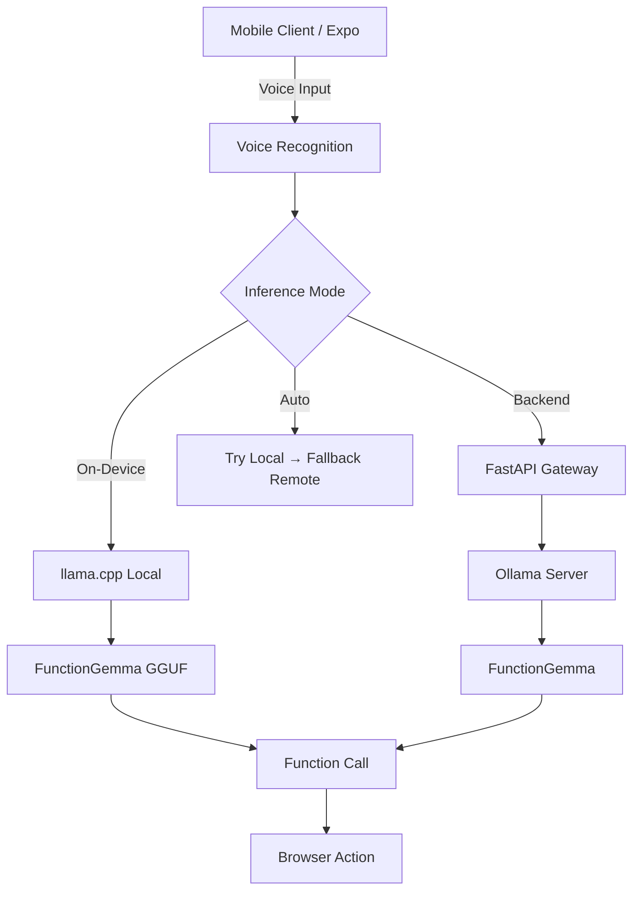

# Nova: Edge-Native AI Orchestration Architecture

A production-ready mobile AI application featuring **voice-controlled browsing** with **on-device inference** capabilities. Built with Expo (React Native), FunctionGemma-270M-IT, and llama.cpp.

[]()
[]()

## Overview

Nova is a hybrid AI architecture that enables **privacy-preserving, low-latency inference** on mobile devices. It supports both **on-device** and **cloud-based** inference, providing flexibility for different deployment scenarios.

### Key Features

- **Native Voice Recognition** - Cross-platform speech-to-text (iOS, Android, Web)
- **Voice-Controlled Browser** - Navigate the web using natural language
- **On-Device AI** - Run FunctionGemma locally via llama.cpp
- **Cloud Fallback** - Automatic backend fallback when needed
- **Privacy-First** - All data stays on device in on-device mode
- **Fast** - Sub-second inference with GPU acceleration
- **Cross-Platform** - iOS, Android, and Web support

## Architecture



### Components

| Layer | Technology | Purpose |
|-------|-----------|---------|
| **Client** | Expo (React Native) | Cross-platform mobile UI |
| **Voice** | Native Speech Recognition | Voice input processing |
| **Inference (Local)** | llama.rn (llama.cpp) | On-device AI inference |
| **Inference (Cloud)** | FastAPI + Ollama | Remote inference fallback |
| **Model** | FunctionGemma-270M-IT | Function calling LLM |

## Quick Start

### Prerequisites

- **Node.js** 18+ and npm
- **Python** 3.10+ (for backend)
- **Ollama** (for cloud mode)
- **Expo CLI** (installed automatically)

### Installation

```bash
# Clone the repository
git clone https://github.com/Vatsa10/Novaa
cd Novaa

# Install dependencies
cd ai-mobile
npm install
```

### Option 1: On-Device Mode (Recommended)

**Step 1: Download Model**
```powershell
# Windows
.\download-model.ps1

# macOS/Linux
chmod +x download-model.sh
./download-model.sh
```

**Step 2: Build & Run**
```bash
cd ai-mobile

# Android
npx expo run:android

# iOS (requires Mac)
npx expo run:ios
```

The app will automatically load the bundled model on first launch!

### Option 2: Cloud Mode (Simpler Setup)

**Step 1: Start Backend**
```bash
cd backend
python -m venv venv
.\venv\Scripts\activate  # Windows
# source venv/bin/activate  # macOS/Linux

pip install -r requirements.txt
python -m uvicorn main:app --host 0.0.0.0 --port 8000 --reload
```

**Step 2: Pull Model**
```bash
ollama pull functiongemma
```

**Step 3: Run App**
```bash
cd ai-mobile
npx expo start --tunnel
```

Scan QR code with Expo Go app!

## Features

### 1. Voice-Controlled Browser

Navigate the web using natural language commands:

| Command | Action | Example |
|---------|--------|---------|
| `open [website]` | Navigate to URL | "open youtube" |
| `search for [query]` | Google search | "search for AI news" |
| `go back` | Browser back | "go back" |
| `go forward` | Browser forward | "go forward" |
| `refresh page` | Reload | "refresh page" |

### 2. Hybrid Inference System

Three inference modes with automatic fallback:

**AUTO Mode** (Default)
- Tries on-device first
- Falls back to backend if unavailable
- Best user experience

**ON_DEVICE Mode**
- 100% local inference
- Maximum privacy
- Works offline

**BACKEND Mode**
- Uses remote server
- Lower memory usage
- Easier setup

### 3. Cross-Platform Voice Recognition

| Platform | Technology | Status |
|----------|-----------|--------|
| **iOS** | Native Speech Recognition | ✅ Fully Supported |
| **Android** | Native Speech Recognition | ✅ Fully Supported |
| **Web** | Web Speech API | ✅ Supported (Chrome/Edge) |

## Project Structure

```
Nova/
├── ai-mobile/                  # Expo React Native app
│   ├── app/
│   │   ├── (tabs)/
│   │   │   ├── index.tsx      # Chat interface
│   │   │   ├── browser.tsx    # Voice browser
│   │   │   └── settings.tsx   # Model management
│   │   └── _layout.tsx        # Root layout (auto-init)
│   ├── services/
│   │   ├── llamaEngine.ts     # llama.cpp wrapper
│   │   ├── voiceService.ts    # Hybrid inference
│   │   └── api.ts             # Backend API client
│   ├── hooks/
│   │   └── useVoiceRecognition.ts  # Cross-platform voice
│   └── assets/
│       └── models/             # Bundled AI models
│
├── backend/                    # FastAPI server
│   ├── main.py                # API endpoints
│   └── requirements.txt       # Python dependencies
│
└── docs/
    ├── ON_DEVICE_INFERENCE.md # On-device setup guide
    ├── MODEL_BUNDLING_GUIDE.md # Model bundling guide
    └── QUICK_SETUP.md         # Quick reference
```

## Configuration

### Inference Mode

```typescript
import { setInferenceMode, InferenceMode } from '@/services/voiceService';

// Auto mode (default)
setInferenceMode(InferenceMode.AUTO);

// On-device only
setInferenceMode(InferenceMode.ON_DEVICE);

// Backend only
setInferenceMode(InferenceMode.BACKEND);
```

### Backend URL

The app automatically detects your local IP. For manual configuration:

```typescript
// ai-mobile/services/voiceService.ts
const API_URL = 'http://YOUR_IP:8000';
```

## Performance

### On-Device Inference

| Device | Speed | Memory | Battery |
|--------|-------|--------|---------|
| iPhone 13+ | ~60 tok/s | ~300MB | Moderate |
| Pixel 7+ | ~50 tok/s | ~300MB | Moderate |
| Mid-range | ~30 tok/s | ~300MB | Higher |

### Model Sizes

| Quantization | Size | Quality | Speed |
|--------------|------|---------|-------|
| Q4_K_M | ~150MB | Good | Fast |
| Q5_K_M | ~180MB | Better | Medium |
| Q8_0 | ~270MB | Best | Slower |

## Development

### Running Tests

```bash
cd ai-mobile
npm test
```

### Building for Production

**Android**:
```bash
eas build --platform android --profile production
```

**iOS**:
```bash
eas build --platform ios --profile production
```

### Environment Variables

Create `.env` file in `ai-mobile/`:

```env
EXPO_PUBLIC_API_URL=http://localhost:8000
EXPO_PUBLIC_INFERENCE_MODE=auto
```

## Deployment

### App Stores

**Google Play**:
- Use Android App Bundle (AAB) format
- Model bundled in expansion file
- Max size: 4GB

**Apple App Store**:
- Model bundled in IPA
- Max size: 4GB
- No special configuration needed

### Over-the-Air Updates

Code and UI updates work via Expo OTA. Model updates require full app rebuild.

## Troubleshooting

### Common Issues

**"Model not loaded"**
- Ensure model is in `ai-mobile/assets/models/`
- Run `npx expo prebuild` to regenerate native projects
- Check console logs for errors

**"Backend connection failed"**
- Verify backend is running on port 8000
- Check firewall settings
- Ensure device and computer on same WiFi

**"Voice recognition not working"**
- Grant microphone permissions
- Use development build (not Expo Go)
- Check platform support

See [Troubleshooting Guide](./ai-mobile/docs/ON_DEVICE_INFERENCE.md#troubleshooting) for more details.

## Documentation

- **[On-Device Inference Guide](./ai-mobile/docs/ON_DEVICE_INFERENCE.md)** - Complete setup for local inference
- **[Model Bundling Guide](./ai-mobile/docs/MODEL_BUNDLING_GUIDE.md)** - Bundle model with your app
- **[Quick Setup](./ai-mobile/docs/QUICK_SETUP.md)** - Quick reference card
- **[API Documentation](./ai-mobile/docs/API.md)** - Backend API reference

## Roadmap

- [ ] Streaming token generation
- [ ] Multi-modal support (images + voice)
- [ ] Custom function definitions
- [ ] Model quantization options in UI
- [ ] Offline model download manager
- [ ] Context caching for faster responses
- [ ] Additional browser commands (scroll, click, form fill)

## Acknowledgments

- [llama.cpp](https://github.com/ggerganov/llama.cpp) - Fast LLM inference
- [llama.rn](https://github.com/mybigday/llama.rn) - React Native bindings
- [FunctionGemma](https://huggingface.co/google/functiongemma-270m-it) - Google's function calling model
- [Expo](https://expo.dev) - React Native framework

## Support

- **Issues**: [GitHub Issues](https://github.com/Vatsa10/MobileApp/issues)
- **Discussions**: [GitHub Discussions](https://github.com/Vatsa10/MobileApp/discussions)

---