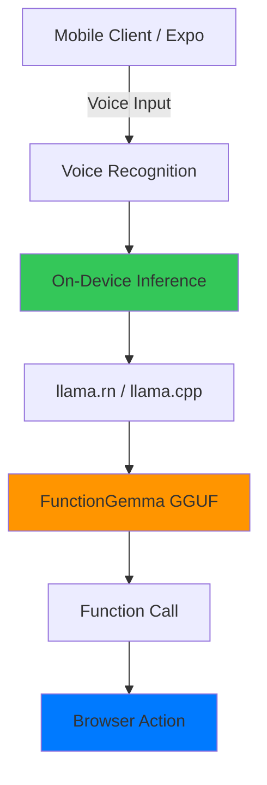

# Nova: On-Device AI Voice Browser

A production-ready mobile AI application featuring voice-controlled browsing with 100% on-device inference. Built with Expo (React Native), FunctionGemma-270M-IT, and llama.cpp.

[]()
[]()
[]()

## Overview

Nova is a privacy-first mobile AI browser that runs entirely on your device. No backend server, no cloud processing, no data transmission - just pure on-device AI inference.

### Key Features

- **Native Voice Recognition** - Cross-platform speech-to-text (iOS, Android, Web)
- **Voice-Controlled Browser** - Navigate the web using natural language
- **On-Device AI** - 100% local inference via llama.cpp
- **Complete Privacy** - All data stays on your device
- **Fast Performance** - Sub-second inference with GPU acceleration
- **Cross-Platform** - iOS, Android, and Web support
- **Offline Operation** - Works without internet connection

## Architecture



### Components

| Layer | Technology | Purpose |
|-------|-----------|---------|
| **Client** | Expo (React Native) | Cross-platform mobile UI |
| **Voice** | Native Speech Recognition | Voice input processing |
| **Inference** | llama.rn (llama.cpp) | On-device AI inference |
| **Model** | FunctionGemma-270M-IT (GGUF) | Function calling LLM |

## Quick Start

### Prerequisites

- **Node.js** 18+ and npm
- **Expo CLI** (installed automatically)
- **FunctionGemma Model** (~150MB)

### Installation

```bash
# Clone the repository
git clone https://github.com/Vatsa10/Novaa.git
cd Novaa

# Install dependencies
cd ai-mobile
npm install
```

### Setup

**Step 1: Download Model**
```powershell
# Windows
.\download-model.ps1

# macOS/Linux
chmod +x download-model.sh
./download-model.sh
```

**Step 2: Build & Run**
```bash
cd ai-mobile

# Android
npx expo run:android

# iOS (requires Mac)
npx expo run:ios

# Web (for testing)
npx expo start --web
```

The application will automatically load the bundled model on first launch.

## Features

### 1. Voice-Controlled Browser

Navigate the web using natural language commands:

| Command | Action | Example |
|---------|--------|---------|
| `open [website]` | Navigate to URL | "open youtube" |
| `search for [query]` | Google search | "search for AI news" |
| `go back` | Browser back | "go back" |
| `go forward` | Browser forward | "go forward" |
| `refresh page` | Reload | "refresh page" |

### 2. On-Device AI Inference

**100% Privacy**
- All AI processing happens on your device
- No data transmitted to servers
- No cloud dependencies
- Works completely offline

**Fast Performance**
- Sub-second inference
- GPU/Metal acceleration
- Optimized GGUF quantization
- Efficient memory usage

### 3. Cross-Platform Voice Recognition

| Platform | Technology | Status |
|----------|-----------|--------|
| **iOS** | Native Speech Recognition | Fully Supported |
| **Android** | Native Speech Recognition | Fully Supported |
| **Web** | Web Speech API | Supported (Chrome/Edge) |

## Project Structure

```
Nova/
├── ai-mobile/                  # Expo React Native app
│   ├── app/
│   │   ├── (tabs)/
│   │   │   ├── index.tsx      # Home/Welcome screen
│   │   │   ├── browser.tsx    # Voice browser
│   │   │   └── settings.tsx   # Model management
│   │   └── _layout.tsx        # Root layout (auto-init)
│   ├── services/
│   │   ├── llamaEngine.ts     # llama.cpp wrapper
│   │   └── voiceService.ts    # On-device inference
│   ├── hooks/
│   │   └── useVoiceRecognition.ts  # Cross-platform voice
│   └── assets/
│       └── models/             # Bundled AI models
│
└── docs/
    ├── ON_DEVICE_INFERENCE.md # On-device setup guide
    ├── MODEL_BUNDLING_GUIDE.md # Model bundling guide
    ├── BACKEND_REMOVAL.md     # Migration notes
    └── QUICK_SETUP.md         # Quick reference
```

## Configuration

### Model Bundling

The application automatically loads the bundled model from `assets/models/`. To bundle a different model:

1. Download your model (`.gguf` format)
2. Place in `ai-mobile/assets/models/`
3. Update path in `llamaEngine.ts` if needed
4. Rebuild: `npx expo run:android`

### Manual Model Loading

Users can also load models manually via Settings:

1. Download FunctionGemma GGUF
2. Transfer to device
3. Settings → Load Model
4. Select `.gguf` file

## Performance

### On-Device Inference

| Device | Speed | Memory | Battery |
|--------|-------|--------|---------|
| iPhone 13+ | ~60 tok/s | ~300MB | Moderate |
| Pixel 7+ | ~50 tok/s | ~300MB | Moderate |
| Mid-range | ~30 tok/s | ~300MB | Higher |

### Model Sizes

| Quantization | Size | Quality | Speed |
|--------------|------|---------|-------|
| Q4_K_M | ~150MB | Good | Fast |
| Q5_K_M | ~180MB | Better | Medium |
| Q8_0 | ~270MB | Best | Slower |

**Recommended**: Q4_K_M for best balance

## Development

### Running Tests

```bash
cd ai-mobile
npm test
```

### Building for Production

**Android**:
```bash
eas build --platform android --profile production
```

**iOS**:
```bash
eas build --platform ios --profile production
```

### Environment Variables

Create `.env` file in `ai-mobile/`:

```env
EXPO_PUBLIC_MODEL_PATH=assets/models/functiongemma-270m-it-Q4_K_M.gguf
```

## Deployment

### App Stores

**Google Play**:
- Use Android App Bundle (AAB) format
- Model bundled in expansion file
- Max size: 4GB

**Apple App Store**:
- Model bundled in IPA
- Max size: 4GB
- No special configuration needed

### Over-the-Air Updates

Code and UI updates work via Expo OTA. Model updates require full app rebuild.

## Privacy & Security

### Data Privacy

**100% On-Device Processing**
- All AI inference happens locally
- No data sent to external servers
- No analytics or tracking
- No internet required for AI

**Secure Storage**
- Models stored in app sandbox
- No cloud synchronization
- User data never leaves device

### Permissions

**iOS**:
- Microphone (for voice input)
- Speech Recognition (for voice commands)

**Android**:
- RECORD_AUDIO (for voice input)

## Troubleshooting

### Common Issues

**"Model not loaded"**
- Ensure model is in `ai-mobile/assets/models/`
- Run `npx expo prebuild` to regenerate native projects
- Check console logs for errors

**"Voice recognition not working"**
- Grant microphone permissions
- Use development build (not Expo Go)
- Check platform support

**"Out of memory"**
- Use Q4_K_M quantization (not Q8_0)
- Close other apps
- Reduce context window in settings

See [Troubleshooting Guide](./ai-mobile/docs/ON_DEVICE_INFERENCE.md#troubleshooting) for more details.

## Documentation

- **[On-Device Inference Guide](./ai-mobile/docs/ON_DEVICE_INFERENCE.md)** - Complete setup for local inference
- **[Model Bundling Guide](./ai-mobile/docs/MODEL_BUNDLING_GUIDE.md)** - Bundle model with your app
- **[Quick Setup](./ai-mobile/docs/QUICK_SETUP.md)** - Quick reference card

## Roadmap

- Streaming token generation
- Multi-modal support (images + voice)
- Custom function definitions
- Model quantization options in UI
- Context caching for faster responses
- Additional browser commands (scroll, click, form fill)
- Bookmark management
- History tracking
- Tab management

## Acknowledgments

- [llama.cpp](https://github.com/ggerganov/llama.cpp) - Fast LLM inference
- [llama.rn](https://github.com/mybigday/llama.rn) - React Native bindings
- [FunctionGemma](https://huggingface.co/google/functiongemma-270m-it) - Google's function calling model
- [Expo](https://expo.dev) - React Native framework

## Support

- **Issues**: [GitHub Issues](https://github.com/Vatsa10/Novaa/issues)

---

Built with Expo, React Native, and llama.cpp

**100% Privacy • 100% On-Device • 100% Offline**